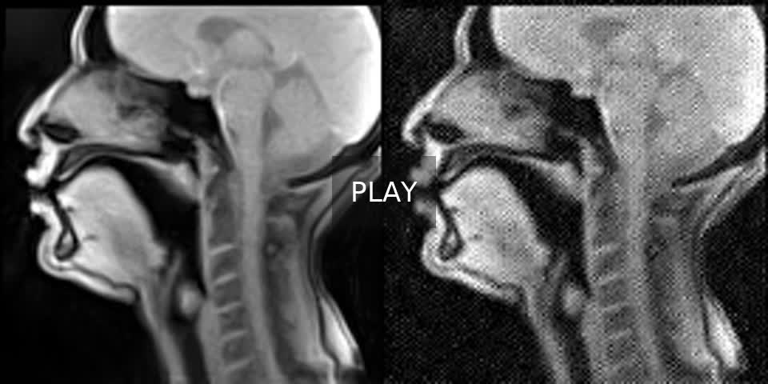

# SPAN-rtmri ArtSpeech DB2

## Goal

Generate short rtMRI videos from speech audio plus one conditioning MRI frame.

This repo is a cleaned ArtSpeech DB2 adaptation of the Speech2rtMRI / SPAN-rtmri idea.
The supported code lives in `speech2rtmri_artspeech/`.

## Data

- Dataset: `ArtSpeech_Database_2`
- Root path in current configs:
  `/srv/storage/talc@storage4.nancy/multispeech/corpus/speech_production/iadi`
- Default resolution:
  `136x136`
- Default policy:
  use registered MRI when available and prefer adjusted TextGrids

Expected session layout:

```text
ArtSpeech_Database_2/<speaker>/<session>/
├── <speaker>_<session>.wav
├── *.textgrid
├── NPY_MR/
├── inference_contours/
├── NPY_MR_registered/               optional
└── inference_contours_registered/   optional
```

## Paper And Source

- Paper:
  `Speech2rtMRI`
  https://arxiv.org/abs/2409.15525
- Upstream source:
  https://github.com/Hong7Cong/SPAN-rtmri
- Local supported package:
  `speech2rtmri_artspeech/`

## Demo

Canonical demo video:

[](https://raw.githubusercontent.com/nnnam2609/SPAN-rtmri-artspeech/main/outputs/speech2rtmri_artspeech_full_database_grouille_a100_10h/demo_sessions/demo_sessions_1804_20260416_220233/1804_S14/side_by_side_session.mp4)

Click the preview image to play the mp4 in the browser.

Direct file:
[`side_by_side_session.mp4`](https://raw.githubusercontent.com/nnnam2609/SPAN-rtmri-artspeech/main/outputs/speech2rtmri_artspeech_full_database_grouille_a100_10h/demo_sessions/demo_sessions_1804_20260416_220233/1804_S14/side_by_side_session.mp4)

This is the main demo to open first.

## Kept Configs

- `configs/speech2rtmri_artspeech/default.yaml`
- `configs/speech2rtmri_artspeech/full_database_grouille_a100_10h.yaml`

## Kept Scripts

- `scripts/prepare_speech2rtmri_artspeech_cpu.sh`
- `scripts/job_train_speech2rtmri_artspeech_full_database_grouille_a100_10h.sh`
- `scripts/submit_train_speech2rtmri_artspeech_full_database_grouille_a100_10h_oar.sh`

## Minimal Workflow

Prepare manifests and caches on the frontend/login server:

```bash
./scripts/prepare_speech2rtmri_artspeech_cpu.sh
```

Run the full database job:

```bash
./scripts/submit_train_speech2rtmri_artspeech_full_database_grouille_a100_10h_oar.sh
```

## Output

Main full-run output root:

```text
outputs/speech2rtmri_artspeech_full_database_grouille_a100_10h/
```

Important subfolders:

```text
outputs/speech2rtmri_artspeech_full_database_grouille_a100_10h/
├── manifests/
├── train/
├── demo/
└── eval/
```

Generated videos are under:

```text
outputs/speech2rtmri_artspeech_full_database_grouille_a100_10h/demo/demo_<run_id>/<sample_id>/
├── gt_video.mp4
├── pred_video.mp4
└── side_by_side.mp4
```


## Notes

- This repo keeps the video-only path.
- Contour metrics stay optional.
